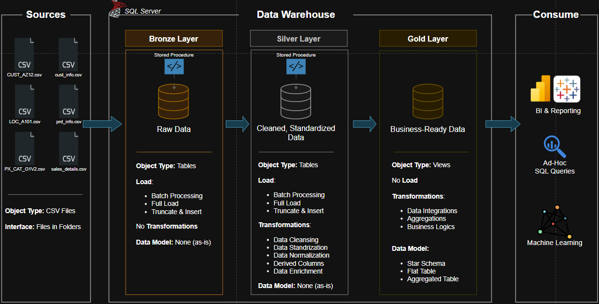

# Data Warehouse and Analytics Project

Welcome to the **Data Warehouse and Analytics Project** repository! 🚀  
This project demonstrates the design and implementation of a **modern data warehouse solution**, from raw data ingestion to analytical insights.

The goal of this project is to showcase **data engineering and analytics skills** by building a complete pipeline including:

- Data ingestion
- Data transformation
- Dimensional modeling
- Analytical querying

This project was created as part of my **data engineering / data analytics portfolio** and follows industry best practices used in modern data platforms.

---
## 🏗️ Data Architecture

The architecture follows the **Medallion Architecture pattern** with three layers:

Bronze → Silver → Gold



1. **Bronze Layer**: Stores raw data as-is from the source systems. Data is ingested from CSV Files into SQL Server Database.
2. **Silver Layer**: This layer includes data cleansing, standardization, and normalization processes to prepare data for analysis.
3. **Gold Layer**: Houses business-ready data modeled into a star schema required for reporting and analytics.

---
# 📖 Project Overview

This project includes the full lifecycle of a **data warehouse implementation**.

### 1️⃣ Data Architecture
Designing a **modern layered data architecture** using:

- Bronze (raw data)
- Silver (cleaned data)
- Gold (analytical models)

### 2️⃣ ETL Pipelines
Developing SQL-based pipelines to:

- Extract data from CSV files
- Transform and clean data
- Load it into structured warehouse tables

### 3️⃣ Data Modeling
Creating a **star schema** including:

- Dimension tables
- Fact tables
- Surrogate keys
- Optimized relationships

### 4️⃣ Analytics & Reporting
Using SQL queries to analyze:

- Sales performance
- Customer behavior
- Product trends

---

# 🎯 Skills Demonstrated

This project highlights practical experience with:

- SQL Development
- Data Engineering
- ETL Pipelines
- Data Modeling
- Data Warehousing
- Data Cleaning & Transformation
- Analytical Querying

---
## 🛠️ Important Links & Tools:

- **[Datasets](datasets/):** Access to the project dataset (csv files).
- **[SQL Server Express](https://www.microsoft.com/en-us/sql-server/sql-server-downloads):** Lightweight server for hosting your SQL database.
- **[SQL Server Management Studio (SSMS)](https://learn.microsoft.com/en-us/sql/ssms/download-sql-server-management-studio-ssms?view=sql-server-ver16):** GUI for managing and interacting with databases.
- **[Git Repository](https://github.com/):** Set up a GitHub account and repository to manage, version, and collaborate on your code efficiently.
- **[DrawIO](https://www.drawio.com/):** Design data architecture, models, flows, and diagrams.
- **[Notion](https://www.notion.com/):** All-in-one tool for project management and organization.

---

## 🚀 Project Requirements

### Building the Data Warehouse (Data Engineering)

#### Objective
Develop a modern data warehouse using SQL Server to consolidate sales data, enabling analytical reporting and informed decision-making.

#### Specifications
- **Data Sources**: Import data from two source systems (ERP and CRM) provided as CSV files.
- **Data Quality**: Cleanse and resolve data quality issues prior to analysis.
- **Integration**: Combine both sources into a single, user-friendly data model designed for analytical queries.
- **Scope**: Focus on the latest dataset only; historization of data is not required.
- **Documentation**: Provide clear documentation of the data model to support both business stakeholders and analytics teams.

---

# 📊 Analytics & Reporting

The warehouse enables analysis of:

### Customer Behavior
- Customer demographics
- Purchase patterns

### Product Performance
- Product category performance
- Best-selling products

### Sales Trends
- Revenue trends
- Order volumes
- Sales distribution

---

## 📂 Repository Structure
```
data-warehouse-project/
│
├── datasets/                           # Raw datasets used for the project (ERP and CRM data)
│   ├── cust_info.csv     |
│   ├── prd_info.csv      | source_crm
│   ├── sales_details.csv |
│   ├── CUST_AZ12.csv     |
│   ├── LOC_A101.csv      | source_erp
│   └── PX_CAT_G1V2.csv   |
│
├── docs/                               # Project documentation and architecture details
│   └── ...
│
├── scripts/                            # SQL scripts for ETL and transformations
│   ├── init_database.sql               # Scripts for create datawarehouse database
│   ├── load_bronze.sql                 # Scripts for extracting and loading raw data
│   ├── load_silver.sql                 # Scripts for load silver schema tables
│   ├── load_gold_view.sql              # Scripts for load gold schema viewer
│   ├── tables_bronze.sql               # Scripts for load bronze schema tables
│   └── tables_silver.sql               # Scripts for load silver schema tables
│
├── quality-check/                      # quality files
│   ├── quality_checks_gold.sql
│   └── quality_checks_silver.sql
│
├── README.md                           # Project overview and instructions
├── LICENSE                             # License information for the repository
└── .gitignore                          # Files and directories to be ignored by Git
```
---


## 🛡️ License

This project is licensed under the [MIT License](LICENSE). You are free to use, modify, and share this project with proper attribution.

# 👨‍💻 About Me

Hi! I'm **Leandro Gallo**, a **Systems Engineering student** from Argentina with a strong interest in:

- Data Engineering
- Data Analytics
- Backend Development
- Cybersecurity
- Software Development

I enjoy building **data pipelines, automation tools, and data-driven systems**, and I am currently developing projects to strengthen my skills in **data architecture, SQL development, and analytics**.

This repository is part of my **technical portfolio**, where I showcase projects related to:

- Data Warehousing
- ETL Pipelines
- Data Modeling
- Analytics

---

# 🔗 Connect With Me

📧 Email  
leandrogallo698@gmail.com


